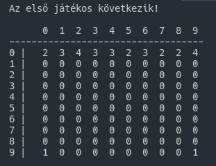
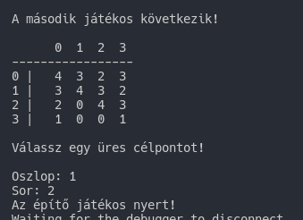

# Cannons Game (TTY)

* A játékot **két játékos** játszhatja (az egyik építő, a másik romboló)
* A játéktér **tetején véletlen színű téglák** helyezkednek el.
* Alul **egy-egy ágyú** található, amelyet a játékosok a kurzormozgató billentyűkkel irányíthatnak jobbra-balra.
* Az ágyúgolyó egy **véletlen színű tégla**, amely kilövést követően a falhoz ütközik.

1.) Ha a lövedék **azonos színű** téglát talál el, akkor ez és a
szomszédos, szintén ilyen színű téglák **eltűnnek**.

2.) Ha a lövedék **más színű** téglát talál el, akkor a lövedék is **beépül a falba**.

A játékot az építő nyeri, ha a játéktér **megtelik**, a romboló nyeri, ha a
téglák **elfogynak**.

Megjegyés:

> *Sima console app. Nem kell kurzor mozgató billentyű, egyszerűen **x,y koordinátát kérjen be.***

# Játék megjelenése

## Számok jelentése

Szám | jelentése
--- | ---
0 | Semmi nincs ott
1 | Ágyú van ott
2 | Vörös tégla
3 | Sárga tégla
4 | Zöld tégla

## Nyerés

*Az ágyúsor (legalsó) nem számít bele a harcmezőbe!*

